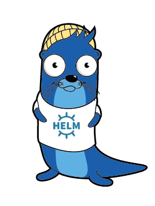

# Adfinis Helm Charts

[](https://artifacthub.io/packages/search?repo=adfinis)

[](https://github.com/pre-commit/pre-commit)



This repository contains [Helm](https://helm.sh/) charts managed by [Adfinis](https://adfinis.com/?pk_campaign=github&pk_kwd=helm-charts).

## Usage

### Install the Helm chart repository

```bash
helm repo add adfinis https://charts.adfinis.com
```

### Install from GHCR OCI registry

The charts are also published to GitHub Container Registry as OCI Helm artifacts by the release workflow.

```bash
# Login using a GitHub token with read access
echo "$GHCR_TOKEN" | helm registry login -u <github-username> --password-stdin ghcr.io

# Pull a chart package from GHCR
helm pull oci://ghcr.io/adfinis/charts/<chart-name> --version <chart-version>

# Install from OCI directly
helm install <release-name> oci://ghcr.io/adfinis/charts/<chart-name> --version <chart-version>
```

### Install on OpenShift

To make the charts available in the OpenShift console:

```bash
oc apply -f https://charts.adfinis.com/adfinis-charts-repo.yaml
```

### Available Helm charts
#### [cert-manager-issuers](charts/cert-manager-issuers) chart

 

Configure cert-manager Issuers and ClusterIssuers via Helm

[](charts/cert-manager-issuers)
#### [hedgedoc](charts/hedgedoc) chart

 

Chart for HedgeDoc, a fork of CodiMD

[](charts/hedgedoc)
#### [keycloak-operator](charts/keycloak-operator) chart

 

Deploy Keycloak Operator and Keycloak

[](charts/keycloak-operator)
