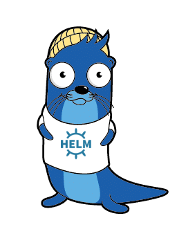

# Adfinis Helm Charts

[](https://artifacthub.io/packages/search?repo=adfinis)

[](https://github.com/pre-commit/pre-commit)



This repository contains [Helm](https://helm.sh/) charts managed by [Adfinis](https://adfinis.com/?pk_campaign=github&pk_kwd=helm-charts).

## Usage

### Install the Helm chart repository

```bash
helm repo add adfinis https://charts.adfinis.com
```

### Available Helm charts
#### [cert-manager-issuers](https://github.com/adfinis/helm-charts/tree/main/charts/cert-manager-issuers) chart

 

Configure cert-manager Issuers and ClusterIssuers via Helm

[](https://github.com/adfinis/helm-charts/tree/main/charts/cert-manager-issuers)
#### [hedgedoc](https://github.com/adfinis/helm-charts/tree/main/charts/hedgedoc) chart

 

Chart for HedgeDoc, a fork of CodiMD

[](https://github.com/adfinis/helm-charts/tree/main/charts/hedgedoc)
#### [keycloak-operator](https://github.com/adfinis/helm-charts/tree/main/charts/keycloak-operator) chart

 

Deploy Keycloak Operator and Keycloak

[](https://github.com/adfinis/helm-charts/tree/main/charts/keycloak-operator)
#### [rbac-definitions](https://github.com/adfinis/helm-charts/tree/main/charts/rbac-definitions) chart

 

Deploy rbac-manager RBACDefinitions via Helm

[](https://github.com/adfinis/helm-charts/tree/main/charts/rbac-definitions)

#### Argo CD app-of-apps charts

Our [Argo CD](https://argoproj.github.io/cd/) app-of-apps Helm charts all implement the [Argo CD app-of-apps pattern](https://argo-cd.readthedocs.io/en/stable/operator-manual/cluster-bootstrapping/#app-of-apps-pattern).
The charts deploy Argo CD Application resources and enable configuring multiple related or "work well together" apps.
To do this they combine Helm repository URLs with chart names and "tested" versions of the charts. In most cases some
examples of how to configure individual apps are also provided. Please reference [our app-of-apps documentation](./docs/argocd-app-of-apps.md)
for more in-depth information.

| Chart | Description | Version |
| ----- | ----------- | ------- |
| [argo-apps](https://github.com/adfinis/helm-charts/tree/main/charts/argo-apps) | Argo CD app-of-apps config for various argo project components |  |
| [azure-apps](https://github.com/adfinis/helm-charts/tree/main/charts/azure-apps) | Argo CD app-of-apps config for Azure applications |  |
| [backup-apps](https://github.com/adfinis/helm-charts/tree/main/charts/backup-apps) | Argo CD app-of-apps config for backup components |  |
| [infra-apps](https://github.com/adfinis/helm-charts/tree/main/charts/infra-apps) | Argo CD app-of-apps config for infrastructure components |  |
| [logging-apps](https://github.com/adfinis/helm-charts/tree/main/charts/logging-apps) | Argo CD app-of-apps config for logging applications |  |
| [misc-apps](https://github.com/adfinis/helm-charts/tree/main/charts/misc-apps) | Argo CD app-of-apps config for miscellaneous small tools |  |
| [security-apps](https://github.com/adfinis/helm-charts/tree/main/charts/security-apps) | Argo CD app-of-apps config for security applications |  |
| [storage-apps](https://github.com/adfinis/helm-charts/tree/main/charts/storage-apps) | Argo CD app-of-apps config for storage applications |  |
| [tracing-apps](https://github.com/adfinis/helm-charts/tree/main/charts/tracing-apps) | Argo CD app-of-apps config for tracing applications |  |

#### more charts

| Chart | Description | Version | App Version |
| ----- | ----------- | ------- | ----------- |
| [argoconfig](https://github.com/adfinis/helm-charts/tree/main/charts/argoconfig) | Configure Argo CD AppProjects an... |  |  |
| [back8sup](https://github.com/adfinis/helm-charts/tree/main/charts/back8sup) | Deploy back8sup to a Kubernetes ... |  |   |
| [barman](https://github.com/adfinis/helm-charts/tree/main/charts/barman) | Chart for Barman PostgreSQL Back... |  |   |
| [cert-manager-monitoring](https://github.com/adfinis/helm-charts/tree/main/charts/cert-manager-monitoring) | Monitor cert-manager with cert-m... |  |  |
| [common](https://github.com/adfinis/helm-charts/tree/main/charts/common) | Common chartbuilding components ... |  |   |
| [csi-secret-provider-class](https://github.com/adfinis/helm-charts/tree/main/charts/csi-secret-provider-class) | A Helm chart to create a SecretP... |  |   |
| [customer-center](https://github.com/adfinis/helm-charts/tree/main/charts/customer-center) | Chart for Customer-Center applic... |  |   |
| [kubernetes-etcd-backup](https://github.com/adfinis/helm-charts/tree/main/charts/kubernetes-etcd-backup) | Chart for kubernetes-etcd-backup... |  |   |
| [mopsos](https://github.com/adfinis/helm-charts/tree/main/charts/mopsos) | Deploy Mopsos to a Kubernetes Cl... |  |   |
| [openshift-etcd-backup](https://github.com/adfinis/helm-charts/tree/main/charts/openshift-etcd-backup) | Chart for openshift-etcd-backup ... |  |   |
| [osschallenge](https://github.com/adfinis/helm-charts/tree/main/charts/osschallenge) | Chart for OSS-Challenge application |  |   |
| [vault-auth](https://github.com/adfinis/helm-charts/tree/main/charts/vault-auth) | A helm chart to install the vaul... |  |   |
| [vault-monitoring](https://github.com/adfinis/helm-charts/tree/main/charts/vault-monitoring) | monitor your vault server from w... |  |  |

## Contributing


This Helm chart repositories code may be found on [GitHub](https://github.com) at
[adfinis/helm-charts](https://github.com/adfinis/helm-charts).

We track issues with this chart repository in the [issue tracker](https://github.com/adfinis/helm-charts/issues).

We expect you to always create an issue prior to creating a new chart. This helps us discuss the merits of it before you put the effort into creating the chart.

## About this repository

Adfinis fights for a software world that is more open, where the quality is
better and where software must be accessible to everyone. This repository
contains part of the action behind this commitment. Feel free to
[contact](https://adfinis.com/en/contact/?pk_campaign=github&pk_kwd=helm-charts)
us if you have any questions.

## License

This Helm chart collection is free software: you can redistribute it and/or modify it under the terms
of the GNU Affero General Public License as published by the Free Software Foundation,
version 3 of the License.
